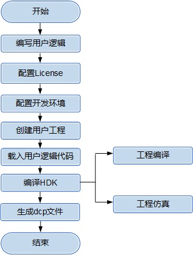
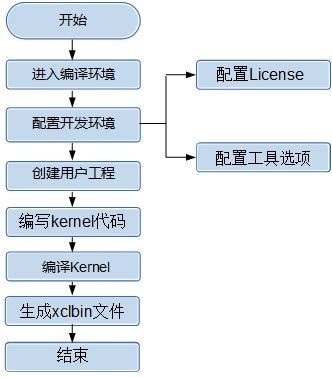
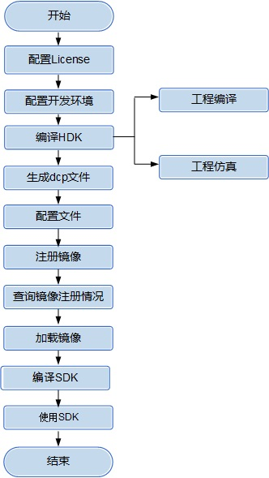
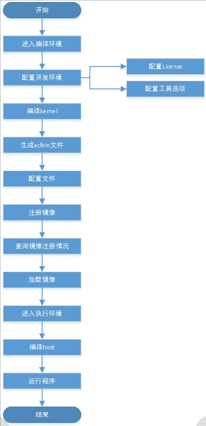

# Contents

1. [FP1-based FPGA Development Suite](#about_fp1)
2. [Quick Hardware Development Guide](#hdk_quick_start)
3. [Quick Software Development Guide](#sdk_quick_start)
4. [Example Operation Instructions](#example)

# 1 FP1-based FPGA Development Suite
The FP1-based FPGA development suite is a cloud FPGA hardware/software development kit based on Huawei enterprise cloud services. This suite helps users to design, simulate, implement, and one-click compilation run on FPGA, and provides professional design and verification components to help users efficiently implement FPGA development. The suite provides tools for hardware and software development, respectively. The hardware development suite helps users to complete project compilation, simulation, and generate the .dcp or .xclbin file. The software development suite guides users to register and load an FPGA image, and compile and debug user applications.

You need to [download the FPGA development suite](#download_toolkit) before using. The hardware development tools are stored in the [hardware](./fp1/hardware) directory, including Vivado and SDAccel development tool. The software development tools are stored in the [software](./fp1/software) directory, including configure files, drivers, tools, and related applications which is needed when running instance. To complete FPGA development, you need to compile and install the FPGA image management tool fisclient and FPGA image loading tool FpgaCmdEntry.

## 1.1 Downloading Suite

For HTTPS connections, run the `git clone https://github.com/Huawei/huaweicloud-fpga.git` command to download the suite.

For SSH connections, run the `git@github.com:Huawei/huaweicloud-fpga.git` command to download the suite.

**Note**: Ensure that the Git tool is installed before downloading the development suite.

##1.2 Compiling and Installing Tools

### 1.2.1 Compiling and Installing the FPGA Image Management Tool
The fisclient is a cross-platform command-line interface (CLI) tool used for FPGA image management, which is mandatory before FPGA image loading. By using fisclient, you can register, delete, and query FPGA image (AEI, Accelerated Engine Image), or manage the association between AEIs and elastic cloud server (ECS) images. You can associate an AEI with an ESC image, and release the AEI to the cloud market or share it with other users through the ESC image.

For details, see [fisclient README](./cli/fisclient/README.md).

### 1.2.2 Compiling and Installing the FPGA Image Loading Tool 	
The FPGA image loading tool FpgaCmdEntry is a command-line interdace (CLI) tool, which supports FPGA information query, image loading and query, and virtual LED status query. 

For details, see [fpga_tool README](./fp1/tools/fpga_tool/README.md).

# 2 Quick Hardware Development Guide
Vivado-based and SDAccel-based hardware developments are supported by high-performance and general-purpose server architectures, respectively.The hardware development process guides users to create, compile, and simulate a project, and generate the .dcp or .xclbin file. After hardware development, if you need to develop your own applications based on the generated .dcp or .xclbin file, please refer to **Section 3 Quick Software Development Guide**.

+ [2.1 High-performance Architecture Hardware Development Process](#h_quick_start)
+ [2.2 General-purpose Architecture Hardware Development Process](#n_quick_start)

 
## 2.1 High-performance Architecture Hardware Development Process
When using a high-performance architecture, hardware development is based on the Vivado process. The following figure shows the development process.

Vivado-based Hardware Development flow chart

[Vivado-based Hardware Development Process](./fp1/docs/基于vivado硬件开发流程.md)

 
## 2.2 General-purpose Architecture Hardware Development Process
When using a general-purpose architecture, hardware development is based on the SDAccel process. The following figure shows the development process.

SDAccel-based Hardware Development flow chart

[SDAccel-based Hardware Development Process](./fp1/docs/基于SDAccel硬件开发流程.md)

# 3 Quick Software Development Guide
If the .dcp or .xclbin file is generated after hardware development, you can develop FPGA user applications by referring to this section.

+ [3.1 Configuring the Environment](#set_env)
+ [3.2 Compiling and debugging User Applications](#sec_3_2)
+ [3.3 Running User Applications](#sec_3_3)

## 3.1 Configuring the Environment
Environment configuration is required for the FPGA software development, including modifying configuration files, registering an FPGA image, querying the FPGA image, and loading the FPGA image.
### Step 1: Modify configuration files
Before registering and querying an FPGA image, you need to modify configuration files and configure the image. For details, click the following link.

<http://support.huaweicloud.com/usermanual-fpga/zh-cn_topic_0069154765.html>
### Step 2: Register an FPGA image
You can use AEI_Register.sh to register an FPGA image with the image management module. After the registration, an ID is assigned to the FPGA image. Please record this ID, because it can be used to query the registration status, and load, delete, and associate the image.

[Registering an FPGA Image](./fp1/docs/注册FPGA镜像.md)

**Note**: FPGA image registration depends on the FPGA image management tool. You need to [compile and install the FPGA image management tool](#fisclent_install) before registration.

### Step 3: Query the FPGA image
After configuring the files, run the **fisclient** command on the Linux shell to go to the fisclient login screen and enter the HWS account password when prompted. On the fisclient CLI, you can run corresponding commands to query, delete, or associate FPGA images.
For details, see the following file.

[fisclient README](./cli/fisclient/README.md)

### Step 4: Load the FPGA Image
For details, see the following file.

[load an fpga image](./fp1/tools/fpga_tool/docs/load_an_fpga_image.md)

**Note**:

+ [Compile and install the FPGA image loading tool](#loadtool_install) before using.
+ For more details of loading tool, see [fpga_tool README](./fp1/tools/fpga_tool/README.md).

## 3.2 Compiling and debugging User Applications
The procedures for compiling and debugging user applications differ when using different server architectures.

- High-performance Architecture Development Mode

The high-performance architecture development mode uses the DPDK architecture to exchange data between the FPGA and the processors. For details about how to compile and debug user applications, see [DPDK-based User Applications Development Descriptions](./fp1/software/app/dpdk_app/README.md).
If you need to modify the driver, refer to [DPDK-based Driver Development Descriptions](./fp1/software/userspace/dpdk_src/README.md).

- General-purpose Architecture Development Mode

The general-purpose architecture development mode uses the Xilinx SDAccel architecture to exchange data between the FPGA and the processors. For details about how to compile and debug user applications, see [SDAccel-based User Applications Development Descriptions](./fp1/software/app/sdaccel_app/README.md).
If you need to modify the HAL, see the [SDAccel Mode HAL Development Descriptions](./fp1/software/userspace/sdaccel/README.md).

## 3.3 Running User Applications

After the FPGA image loading and application compilation, you can go to the corresponding application directories based on the server architecture type and run the compiled applications.

+ High-performance Architecture Development Mode

Go to the [huaweicloud-fpga/fp1/software/app/dpdk_app/bin](./fp1/software/app/dpdk_app/bin) directory to run user applications.

+ General-purpose Architecture Development Mode

Go to the [huaweicloud-fpga/fp1/software/app/sdaccel_app](./fp1/software/app/sdaccel_app) directory to run user applications.

# 4 Example Operation Instructions
The suite provides examples showing the whole process of hardware/software development. You can refer to the examples to learn FPGA development processes under different server architecture types.

+ [4.1 Compiling the SDK](#sec_4_1)
+ [4.2 Vivado-based Example](#sec_4_2)
+ [4.3 SDAccel-based Example](#sec_4_3)

## 4.1 Compiling the SDK
The compilation process differs when using different types of servers.

For high-performance architectures, see [Vivado-based SDK Configuration and Compilation](./fp1/docs/基于vivado工具的SDK配置及编译.md).

For general-purpose architectures, see [SDAccel-based SDK Configuration and Compilation](./fp1/docs/基于sdaccel工具的SDK配置及编译.md).

## 4.2 Vivado-based Example
For high-performance server architectures, FAC services provide three examples. Example 1 implements user logic version reading, data inversion, and addition functions. Example 2 implements user logic DMA (Direct Memory Access) loopback channels and DDR (DDR SDRAM) read functions. Example 3 implements user logic FPGA memory manage unit (FMMU) function.

Vivado-based example operation flow chart

For details, see [Using Vivado-based Examples](./fp1/docs/使用基于vivado的Example.md).

## 4.3 SDAccel-based Example
For general-purpose server architectures, FAC services provide an example implementing SDAccel-based program simulation and hardware instance execution functions. This section describes the operations of the **mmult_hls** example. For the operations of other examples, see this section.

SDAccel-based example operation flow chart

For details, see [Using an SDAccel-based Example](./fp1/docs/使用基于SDAccel的Example.md).

\----End